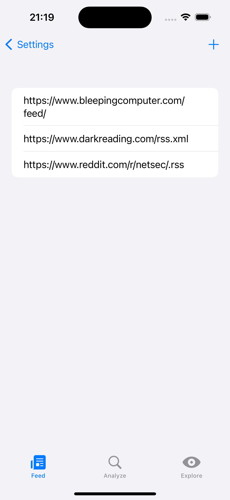
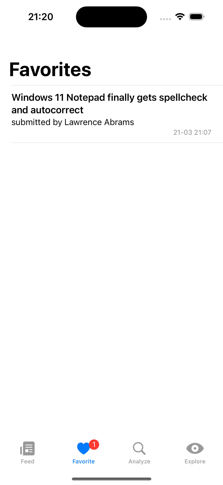
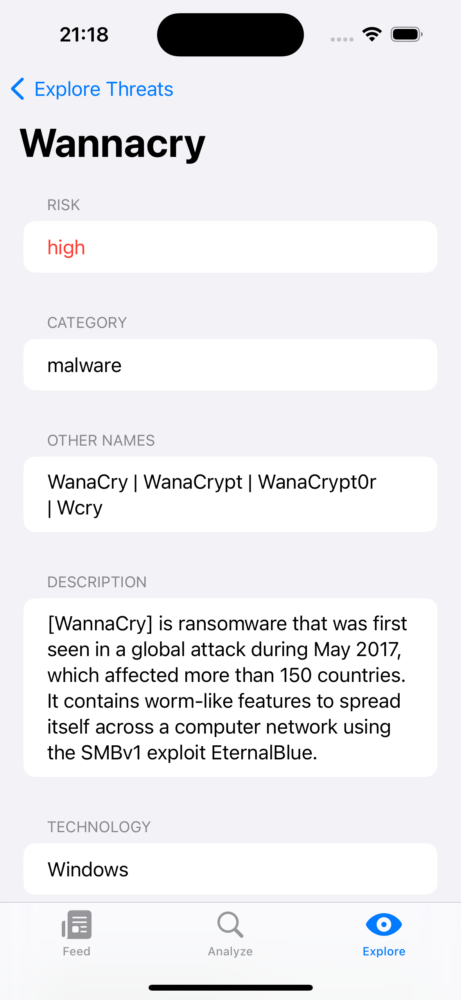

  
  
  

# Pulse

  

>[!NOTE] 
>Minimal iOS Version required to run the app: **17.0**

  
<!-- TABLE OF CONTENTS -->

  
Table of Contents

  <ol>
    <li>
      <a href="#overview">Overview</a></li>
    <li><a href="#features">Features</a></li>
    <li><a href="#built-with">Built with</a></li>
    <li><a href="#author">Author</a></li>
  </ol>

## Overview

  

Pulse is a swift based app which provides a custom news feed with RSS, scanning indicators for possible threats and looking up threat details. 

## Features
- **Custom news feed**
- **Favorise news article**
- **Scan indicators for threats**
- **Lookup threats**
- **Save feeds and favorites in Firebase**
- **Supports RSS 2.0 and Atom format**

## Screenshots

  
  
  
  
  
  
  
  
  
  
  

## Built with
- **[Firebase](https://firebase.google.com/)** for user authentication and saving favorites/feed list
- **[XMLDecoder](https://github.com/CoreOffice/XMLCoder)** for decoding rss feeds
- **[JSONDecoder](https://developer.apple.com/documentation/foundation/jsondecoder)** for decoding rest api calls

## Author
[NoctRise](https://github.com/noctRise/)

